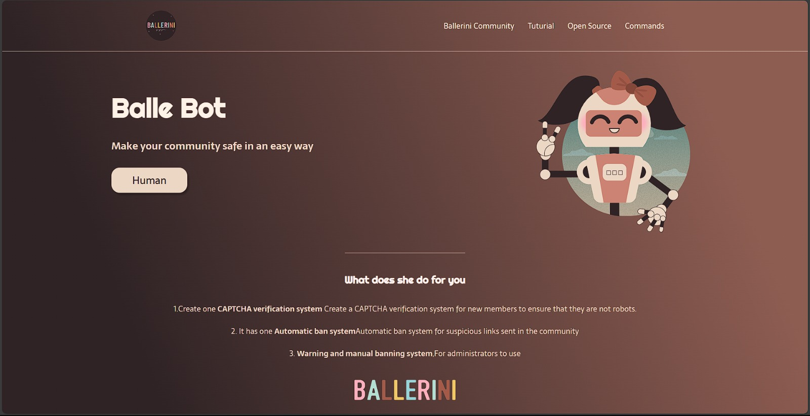
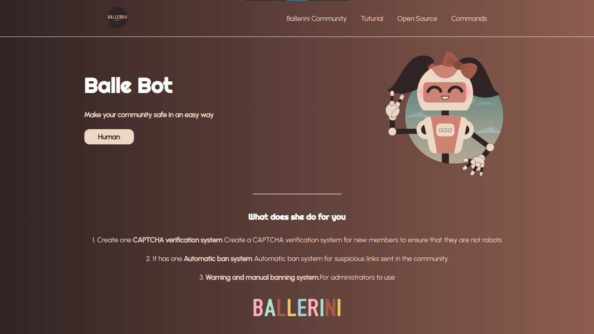

# Ballerina

Ballerina is an open source platform for cloud-native applications. Balle Bot is a chatbot that helps users learn and use Ballerina.

The bot has three main features:

- <b>CAPTCHA verification system:</b> A system that verifies new members are not robots by asking them to solve a CAPTCHA challenge.
- <b>Automatic ban system:</b> A system that automatically bans users who send suspicious links in the community.
- <b>Warning and manual banning system:</b> A system that allows administrators to warn or ban users manually for violating the community rules.

## Aim of the Project

The aim of the project was to replicate the given homepage of the project:

This is the Developed page Design:

